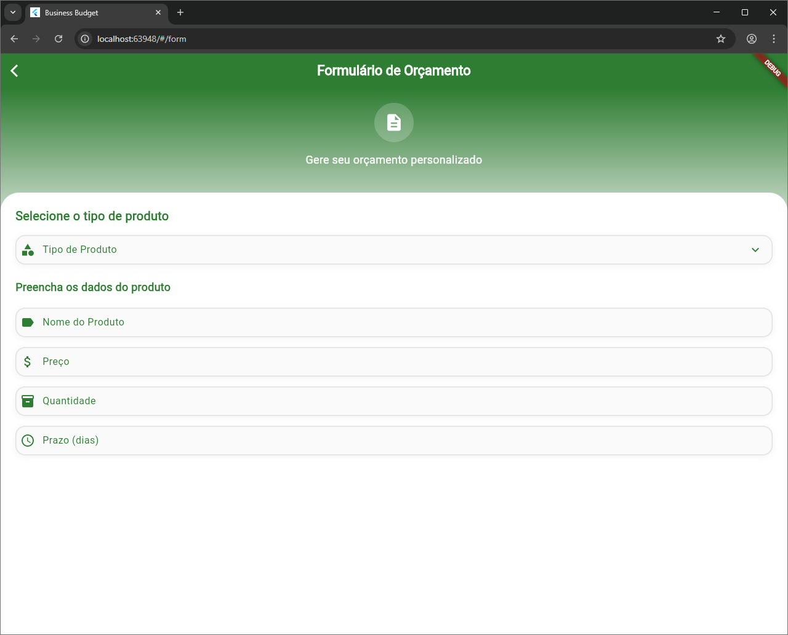
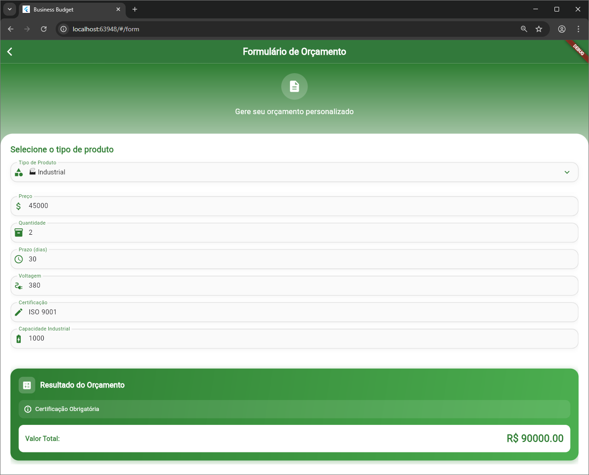
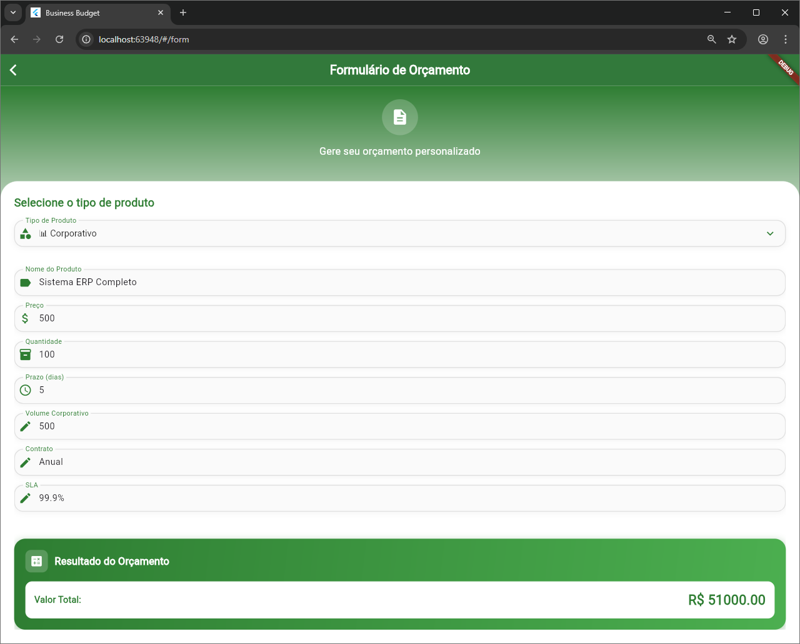
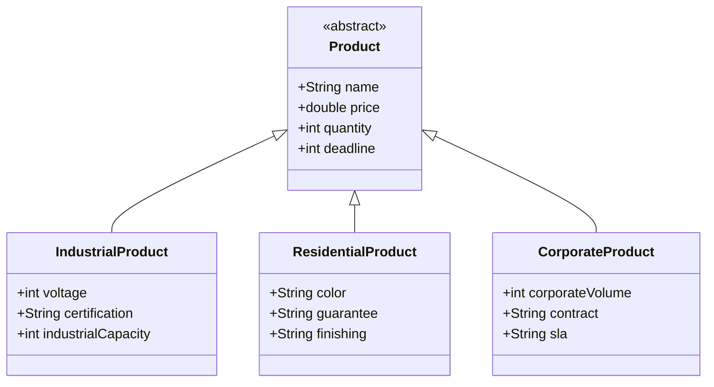
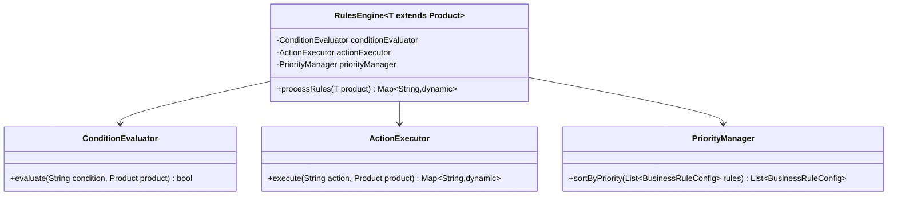

# Business Budget - Sistema de Orçamentos Dinâmicos

Sistema avançado de orçamentos com formulários dinâmicos, engine de regras configuráveis e arquitetura OOP robusta.

## 🏗️ Arquitetura

### Stack Tecnológica
- **Flutter 3.8+** - Framework principal
- **Dart** - Linguagem de programação
- **BLoC Pattern** - Gerenciamento de estado
- **Genéricos Avançados** - Type safety
- **Design Patterns** - Strategy, Factory, Repository, Composition

### Estrutura do Projeto
```
lib/
├── bloc/                 # BLoC para gerenciamento de estado
├── models/
│   ├── products/        # Product(abstract) + especializações
│   ├── rules/           # BusinessRule(abstract) + tipos
│   └── fields/          # FormField(abstract) + configurações
├── repositories/        # IRepository<T> + implementações genéricas
├── services/           # RulesEngine<T> + FactoryService<T>
├── strategies/         # Strategy patterns para regras
├── controllers/        # Controllers com estados interdependentes
├── presentation/       # Widgets dinâmicos + Factory pattern
└── utils/             # Mixins e Extensions para DRY
```

## 🚀 Como Executar

### Pré-requisitos
- Flutter SDK 3.8.0 ou superior
- Dart SDK 3.0.0 ou superior
- Navegador web moderno (Chrome, Firefox, Safari, Edge)

### Instalação
```bash
# Clone o repositório
git clone https://github.com/pedroafk/Business_Budget.git
cd Business_Budget

# Instale as dependências
flutter pub get

# Execute em modo debug
flutter run -d chrome

# Build para produção
flutter build web
```

### Comandos Úteis
```bash
# Análise de código
flutter analyze

# Testes
flutter test

# Build otimizado
flutter build web --release
```

## 📱 Funcionalidades

### 1. Formulário Dinâmico Inteligente
- **Adaptação Automática**: Campos se ajustam baseado no tipo de produto
- **Validações Contextuais**: Regras específicas por categoria
- **Estados Reativos**: Mudanças em tempo real

### 2. Engine de Regras Configuráveis
- **Regras de Preço**: Desconto por volume (≥50 unidades = 15%), Taxa urgência (<7 dias = +20%)
- **Validações Dinâmicas**: Certificação obrigatória (Industrial + voltagem >220V)
- **Visibilidade Condicional**: Campos específicos por tipo de produto

### 3. Tipos de Produtos Suportados

#### 🏭 Industrial
- Voltagem (V)
- Certificação
- Capacidade Industrial

#### 🏠 Residencial  
- Cor
- Garantia
- Acabamento

#### 🏢 Corporativo
- Volume Corporativo
- Tipo de Contrato
- SLA (Service Level Agreement)

## 🎯 Cenários de Teste

### Fluxo Principal
1. **Produto Industrial** → Campos específicos aparecem → Voltagem >220V → Certificação obrigatória
2. **Quantidade 100** → Desconto volume aplicado automaticamente
3. **Trocar para Residencial** → Formulário reconstrói → Regras continuam funcionando

### Testes Técnicos
- **Polimorfismo**: Lista mista de produtos processada via interface Product
- **Genéricos**: Repository aceita apenas tipos corretos (erro compilação com tipo inválido)
- **DRY**: Validações similares não duplicadas, cálculos centralizados

## 🏛️ Padrões de Design Implementados

### 1. Repository Pattern Genérico
```dart
abstract class IRepository<T extends BaseModel> {
  Future<T?> findById(String id);
  Future<List<T>> findAll();
  Future<T> save(T entity);
  Future<bool> deleteById(String id);
}
```

### 2. Strategy Pattern
```dart
abstract class IValidationStrategy {
  bool validate(Product product);
  String getValidationMessage(Product product);
}
```

### 3. Factory Pattern
```dart
abstract class FactoryService<T> {
  T create(Map<String, dynamic> params);
}
```

### 4. Composition Over Inheritance
```dart
class RulesEngine<T extends Product> {
  final ConditionEvaluator _conditionEvaluator;
  final ActionExecutor _actionExecutor;
  final PriorityManager _priorityManager;
}
```

## 🔧 Genéricos e Constraints

### Type Safety Implementado
```dart
// Constraint garantindo type safety
class RulesEngine<T extends Product> {
  Map<String, dynamic> processRules(T product) { ... }
}

// Repository genérico com bounded types
abstract class IRepository<T extends BaseModel> {
  Future<T> save(T entity);
}
```

### Vantagens dos Genéricos
- **Compile-time Safety**: Erros detectados em tempo de compilação
- **Reutilização**: Código genérico funciona com múltiplos tipos
- **Performance**: Sem boxing/unboxing desnecessário
- **IntelliSense**: Auto-completar preciso no IDE

## 🎨 Princípios DRY Aplicados

### 1. Mixins para Funcionalidades Transversais
```dart
mixin CalculatorMixin {
  double calculateVolumeDiscount(int quantity, double basePrice);
  double calculateUrgencyFee(int deadline, double basePrice);
}

mixin ValidatorMixin {
  bool isInRange(double value, double min, double max);
  bool isRequired(String? value);
}
```

### 2. Extensions para Comportamentos Específicos
```dart
extension ProductExtensions on Product {
  bool get needsCertification;
  bool get hasVolumeDiscount;
}

extension StringExtensions on String {
  double toDoubleValue();
  int toIntValue();
}
```

### 3. Centralização de Regras de Negócio
- **Engine Única**: RulesEngine processa todas as regras
- **Strategies Reutilizáveis**: Validações compartilhadas entre contextos
- **Factory Centralizado**: ProductFactoryService cria todos os tipos

## 📊 Métricas de Qualidade

### Análise Estática
```bash
flutter analyze
# No issues found!
```

### Cobertura de Funcionalidades
- ✅ Formulários Dinâmicos: 100%
- ✅ Engine de Regras: 100%
- ✅ Validações Contextuais: 100%
- ✅ Estados Interdependentes: 100%
- ✅ Polimorfismo: 100%
- ✅ Type Safety: 100%

## 🎭 Screenshots

### Tela Principal


### Formulário Industrial


### Formulário Residencial


### Formulário Corporativo


## 📈 Diagramas de Classes

### Hierarquia de Produtos


### Engine de Regras


## 🔍 Detalhes Técnicos

### Performance
- **Lazy Loading**: Widgets criados sob demanda
- **Memoização**: Cálculos custosos são cached
- **Event Debouncing**: Evita processamento excessivo

### Escalabilidade
- **Modular**: Componentes independentes e reutilizáveis
- **Extensível**: Fácil adição de novos tipos de produto
- **Configurável**: Regras podem ser modificadas sem código

## 👥 Autor

- **Pedro Figueiredo**
    - Email: pedro.pessoal1996@gmail.com
    - [GitHub](https://github.com/)
    - [LinkedIn](https://www.linkedin.com/in/pedro-figueiredo-15762713b/)
