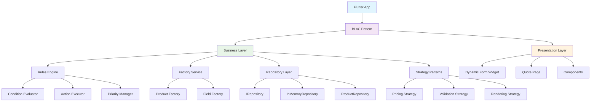
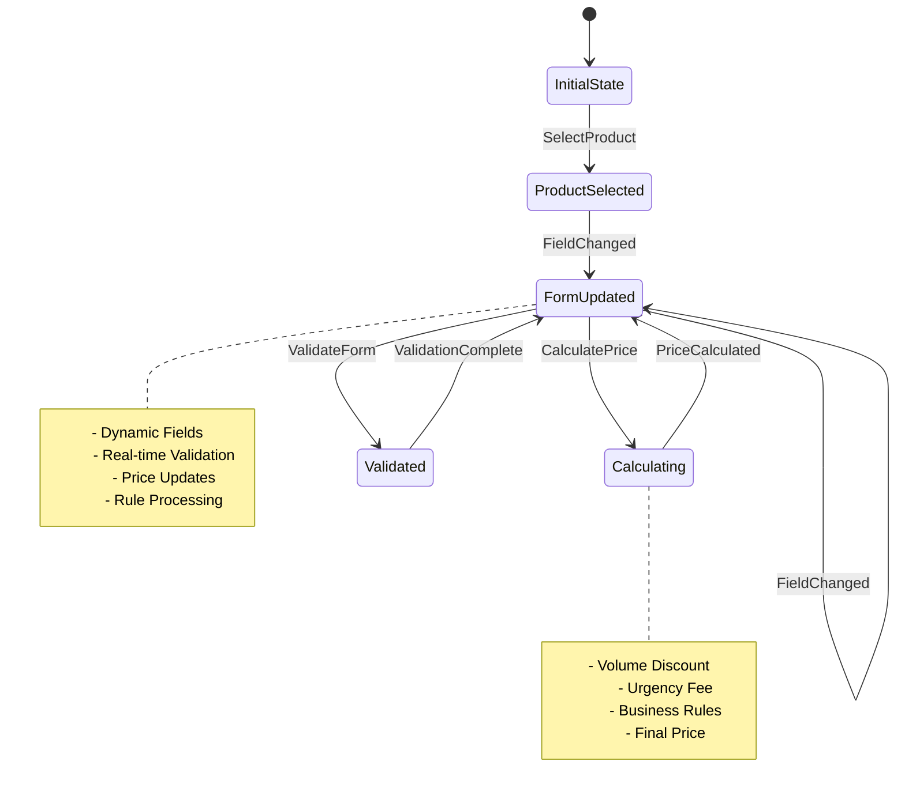
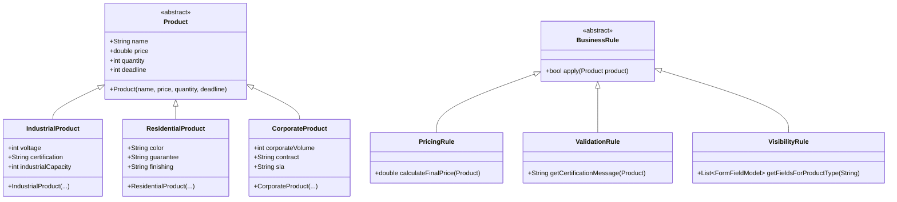
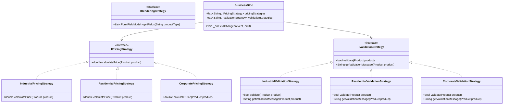
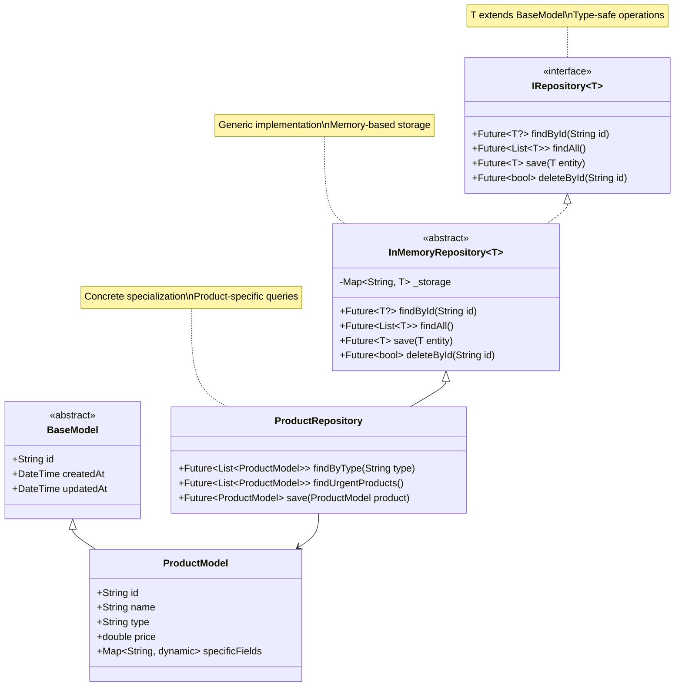
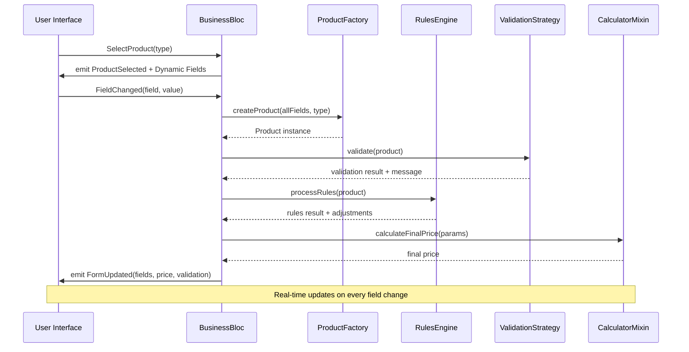
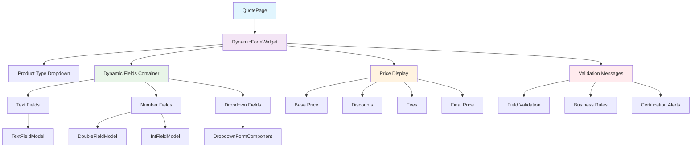
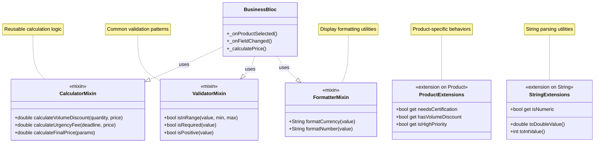
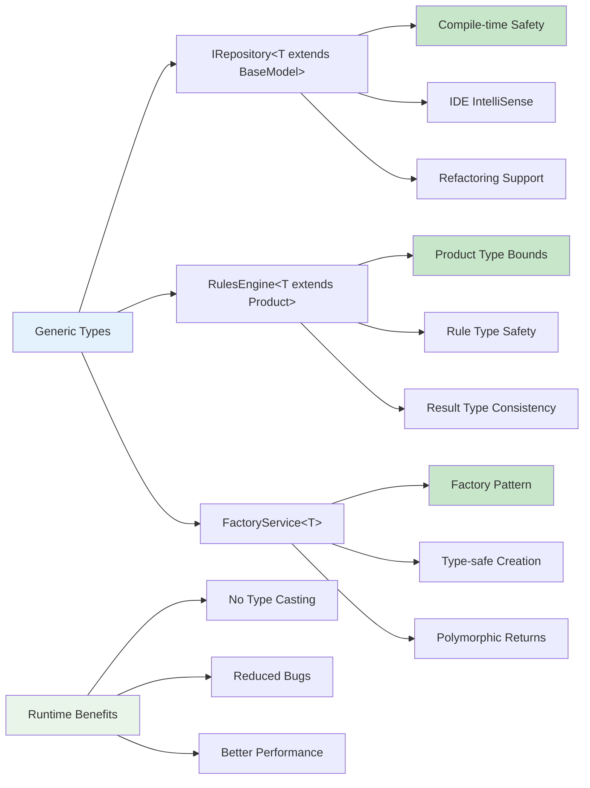

# Diagramas de Sistema - Business Budget

## 🏗️ Diagrama de Arquitetura Geral



## 🔄 Fluxo de Estados BLoC



## 🏭 Hierarquia de Classes de Produto



## 🎯 Padrão Strategy



## 🛠️ Repository Pattern Genérico



## ⚙️ Rules Engine com Composição

```mermaid
graph TB
    A[RulesEngine&lt;T extends Product&gt;] --> B[ConditionEvaluator]
    A --> C[ActionExecutor] 
    A --> D[PriorityManager]
    A --> E[Rule Repository]
    
    B --> B1[evaluate(condition, product)]
    B --> B2[evaluateComplex(conditions)]
    
    C --> C1[execute(action, product)]
    C --> C2[executeMultiple(actions)]
    
    D --> D1[sortByPriority(rules)]
    D --> D2[resolveConflicts(results)]
    
    E --> E1[Volume Discount Rules]
    E --> E2[Urgency Fee Rules]
    E --> E3[Certification Rules]
    E --> E4[Validation Rules]
    
    F[BusinessBloc] --> A
    
    G[Product Input] --> A
    A --> H[Processing Result]
    
    H --> H1[Price Adjustments]
    H --> H2[Validation Messages]
    H --> H3[Field Visibility]
    H --> H4[Business Warnings]
    
    style A fill:#e3f2fd
    style F fill:#f3e5f5
    style G fill:#e8f5e8
    style H fill:#fff8e1
```

## 🔄 Fluxo de Processamento de Formulário



## 📱 Estrutura de Componentes UI



## 🎭 Mixins e Extensions



## 🔐 Type Safety e Constraints



---

*Estes diagramas ilustram a arquitetura robusta e escalável do Business Budget, demonstrando como os padrões de design, genéricos e princípios SOLID trabalham juntos para criar um sistema maintível e extensível.*
